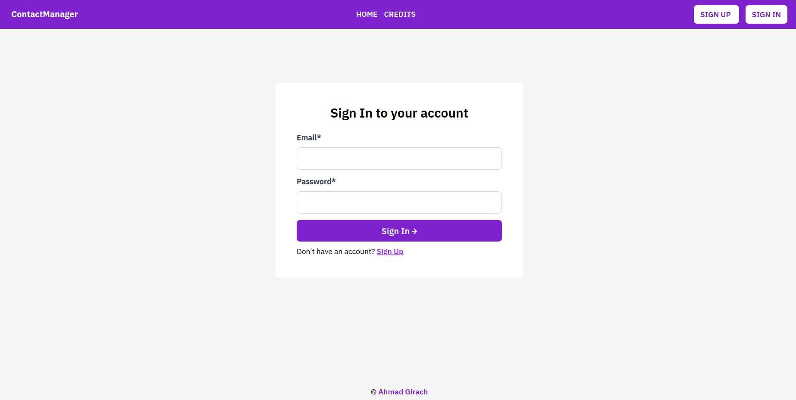
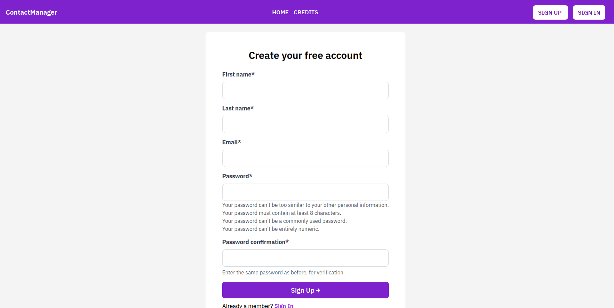
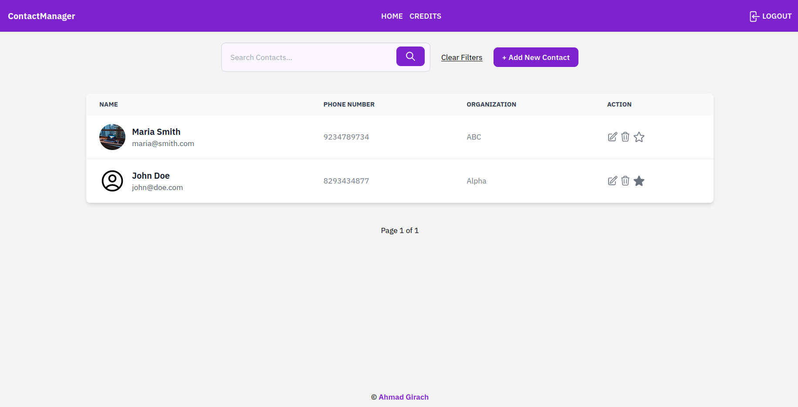

### Contact Manager

Minimalist yet feature rich contact manager web application using Django + Tailwind CSS.

### Setup and Install

Assuming you have `python3` installed. Type the following commands to get started.

- First, create a virtual environment: `python3 -m venv venv`
- Activate it: `source venv/bin/activate`
- Install requirements: `pip install -r requirements.txt`
- Create a .env file inside main directory (copy contents from .env.example file).
- Change the config values as per your need inside .env file.
- `python manage.py makemigrations`
- `python manage.py migrate`
- `python manage.py runserver`
- Project should be running at `localhost:8000`

### Features

- Custom User model (with email login)
- Session Timeout
- Pagination

### Support

If you like this project, make sure to give it a star and share with your friends.

### License

This work is licensed under a <a rel="license" target="_blank" href="http://creativecommons.org/licenses/by/4.0/">Creative Commons Attribution 4.0 International License</a>.

### Previews

